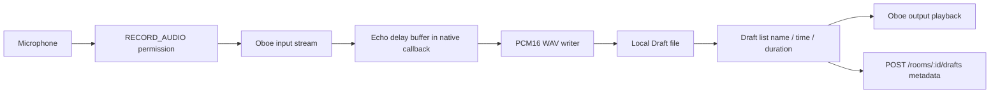

# Audio flow

Implemented effect: **Echo** (250ms delay, 0.45 decay) inside the Oboe `onAudioReady` callback.

Start / Stop finalize a WAV file. Cancel stops the stream and deletes the in-progress file.

Lifecycle: recording and playback cannot overlap; activity destroy stops playback.
