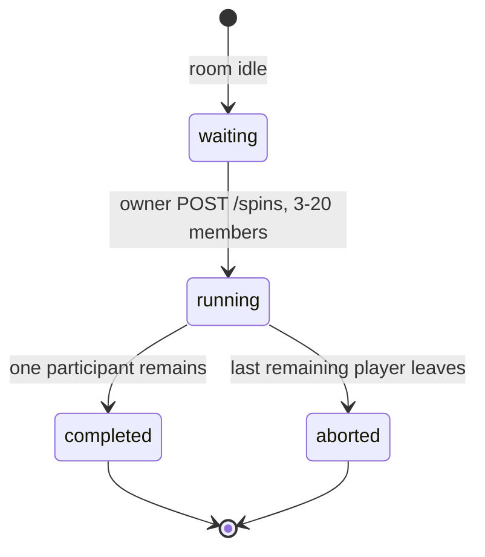
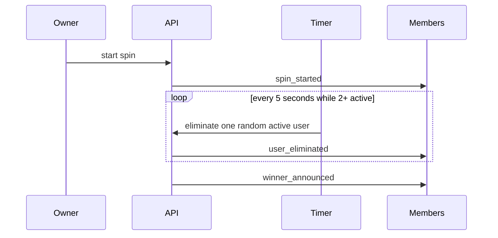

# Spin state machine

Transitions are persisted (`spins.status`, `spin_participants`, append-only `spin_events.seq`). Duplicate `POST /spins` while `running` returns the same spin (`duplicate: true`). Joins after start are room members but not spin participants. Server restart reloads `running` spins and reschedules from `next_elimination_at`. Late ticks eliminate **once**, then wait 5s from **now**.
