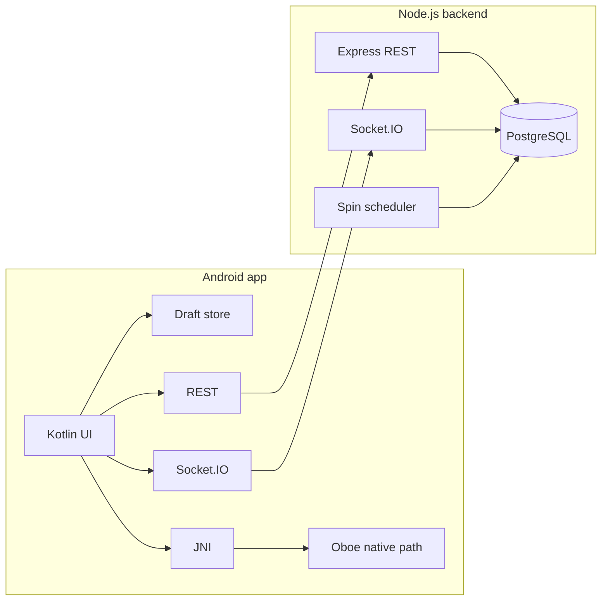

# System architecture

The backend is authoritative for room membership, spin lifecycle and winners. WebSocket does not carry live audio. Draft audio files stay on-device; only metadata is shared with the room.

Identity: `X-User-Id` header after `POST /users`. No OAuth in this assessment.
