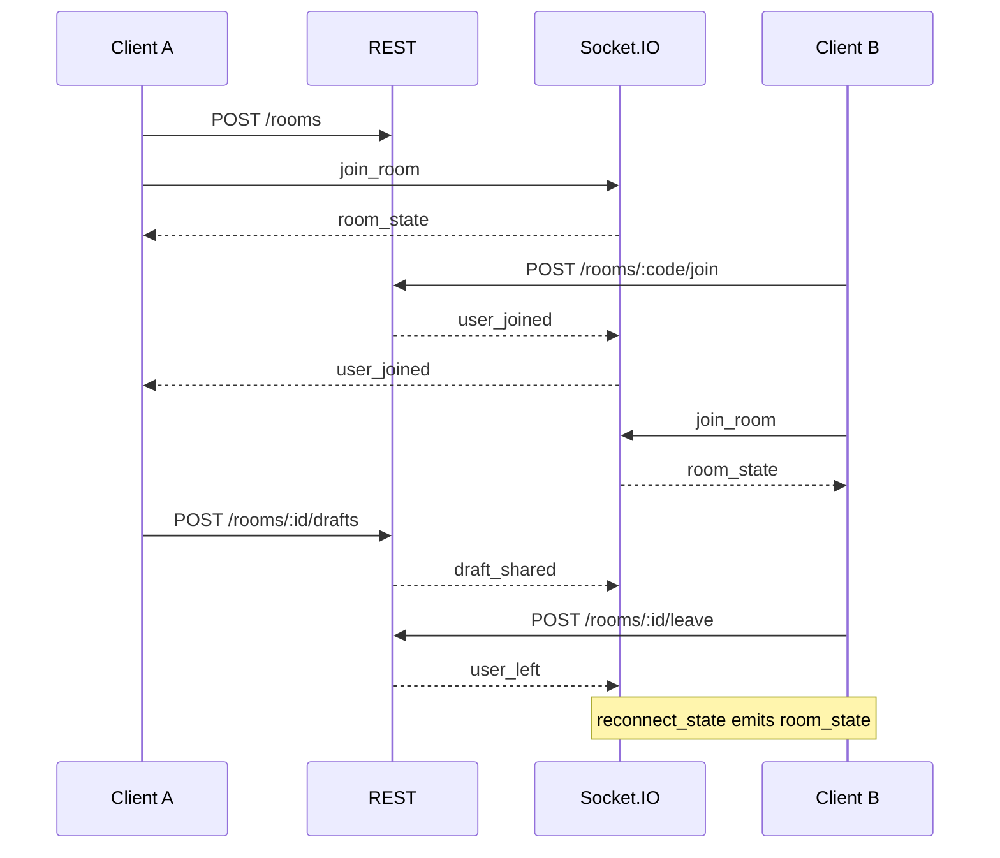

# Room and WebSocket event flow

Mandatory events: `user_joined`, `user_left`, `draft_shared`, `spin_started`, `user_eliminated`, `winner_announced`, `room_state`.

Disconnect: membership stays until REST leave. `connected` is set false after `DISCONNECT_GRACE_MS` (default 15s) if the socket does not return. A spin is not aborted because the owner disconnects; the server timer continues.
